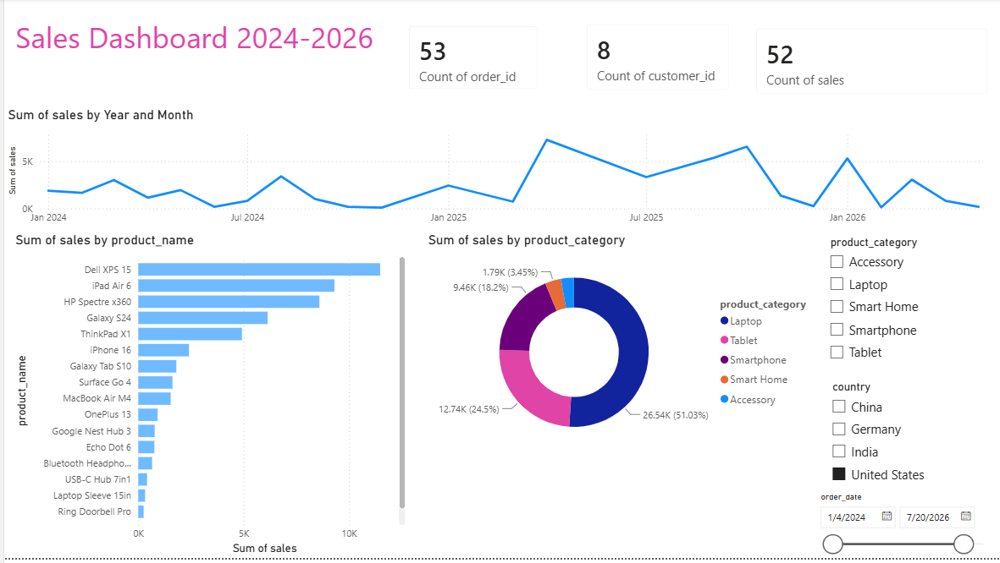

# Sales Dashboard 2024-2026

An interactive Power BI dashboard designed to analyze and track sales performance, product categories, and customer metrics from 2024 through 2026.

## Key Features & Insights
* **Sales Trends:** A dynamic line chart tracking the `Sum of sales` over time (from January 2024 through late 2026), highlighting key revenue peaks and seasonal trends.
* **Product Performance:** A detailed horizontal bar chart breaking down sales by specific products, showing top revenue generators like the *Dell XPS 15* and *iPad Air 6*.
* **Category Distribution:** A donut chart displaying market share by `product_category`, indicating that *Laptops* and *Tablets* drive the majority of the revenue.
* **High-Level KPIs:** Quick-glance metrics tracking total orders (`53`), unique customers (`8`), and overall sales count (`52`).
* **Interactive Slicers:** Built-in filters allowing users to slice data dynamically by `product_category`, `country` (China, Germany, India, United States), and a specific `order_date` timeline.

## Data Model Structure
The report utilizes a relational data model with two primary tables:
1. **customers:** Contains geographical and profile data (`city`, `country`, `customer_name`, `score`, `state`).
2. **orders:** Tracks transactional data (`order_date`, `product_category`, `product_name`, `quantity`, `sales`).

## How to View
1. Download the `my_first_dashboard.pbix` file from this repository.
2. Open it using **Power BI Desktop** to interact with the filters and explore the data models.
